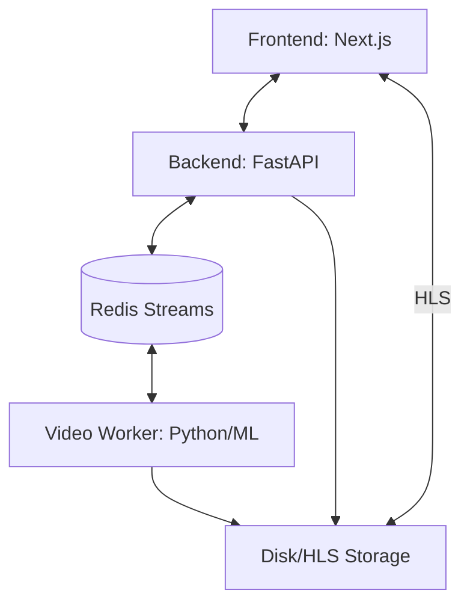

# InfiniteTalk Project Knowledge Base

> [!IMPORTANT]
> **Core Rules for AI Agents (Long-Term Memory)**
> 1. **Read First**: Always read this file (`KNOWLEDGE.md`) at the start of a session to understand the current architecture and state.
> 2. **Update Always**: After implementing significant changes (architectures, new services, bug fixes), update the relevant sections of this file.
> 3. **Preserve "Why"**: Don't just document *what* changed, but *why* it was changed to prevent regressing on past decisions.
> 4. **No Placeholders**: Never use placeholder descriptions; ensure technical details are accurate and derived from the source code.
> 5. **Exercise Production Invariants**: If the production invariant is the thing under test, then the test must exercise the production invariant.

This file serves as a persistent technical memory for the project. It describes the "why" and "how" of the current implementation, key architectural decisions, and operational safety measures.

## 🏗️ Core Architecture

The project follows an asynchronous streaming architecture to maintain low latency for talking avatar generation.

### 1. Frontend (`/web`)
- **Tech Stack**: Next.js, Tailwind, Hls.js.
- **HLS Management**: Uses a singleton `hlsRef`, `isAttachingRef`, and `attachedRef` (hook-safe) to prevent "MediaSource" attachment race conditions and redundant re-attachments that cause flickering.
- **Logs**: Forwards `hls.js` logs/errors to the backend via WebSocket (`type: client_log`). Segment URLs and indices (`video_segment`) are logged to verify synchronization.

### 2. Backend (`/src/app`)
- **Tech Stack**: FastAPI, WebSockets, FFmpeg.
- **HLS Writer**: Manages the `manifest.m3u8`.
    - **Idle Mode**: Seeds the manifest with `idle_XXXXXX.m4s` segments generated by a global FFmpeg process.
    - **Live Mode**: Remuxes `.mp4` results from workers into fragmented `.m4s` segments.
    - **Transitions**: Uses `#EXT-X-DISCONTINUITY` and `#EXT-X-MAP:URI="init.mp4"` to handle stream changes.

### 3. Audio Pipeline (TTS)
- **Flow**: LLM Tokens → ElevenLabs WebSocket → MP3 Chunks → FFmpeg (PCM) → `RollingWav` → Redis.
- **Audio Specs**: 16kHz, mono, s16le.
- **RollingWav**: Accumulates PCM bytes and slices them into overlapping windows (default: 1800ms length, 250ms overlap).

### 4. Video Worker (`/InfiniteTalk/workers/video`)
- **Input**: Listens to Redis Stream `audio_windows`.
- **Processing**: Runs `generate_infinitetalk.py` (GPU/ML).
- **Communication**: Redis `result:{job_id}` keys are used for status polling by the API.
- **Output**: Shared volume `/app/output` ensures the API can access generated `.mp4` files for remuxing.

## 🔗 Redis Event Mapping

| Stream            | Producer            | Consumer            | Data Payload                               |
| :---------------- | :------------------ | :------------------ | :----------------------------------------- |
| `audio_windows`   | Backend (`Session`) | Video Worker        | `{job_id, input_data: {audio_path}, args}` |
| `result:{job_id}` | Video Worker        | Backend (`Session`) | Video status and output path               |

## 🛡️ Safety & Testing Controls

| Variable           | Description                                                                                        |
| :----------------- | :------------------------------------------------------------------------------------------------- |
| `ALLOW_GENERATION` | Must be `true` for the worker to run real ML processing.                                           |
| `FAKE_RUN`         | If `true`, the worker copies `idle_loop.mp4` to the output to verify the full pipeline end-to-end. |

## 📼 HLS Streaming Mechanics

- **Initialization**: `init.mp4` (idle) and `live_init_{session_id}.mp4` (live) contain the fMP4 headers.
- **File Naming**:
    - Idle: `idle_XXXXXX.m4s` (global/persistent).
    - Live: `seg_{session_id}_XXXX.m4s` (unique per session to prevent collisions).
- **Manifest Sync**:
    - **Isolation**: `HLSManager` tracks active live sessions via a registry. The idle loop is strictly paused when any live session is active.
    - **Durations**: `ffprobe` is used to detect the **actual** duration of each segment before adding it to the manifest, ensuring player buffer stability.
    - **Window Size**: Increased to **120 segments (~6 minutes)** and the FFmpeg buffer to **300 segments** to provide headroom for player catch-up and catch 404s.
    - **Idempotency**: `HLSWriter` ignores duplicate segment additions to prevent manifest corruption during sync-loop restarts.
    - **Source Transitions**: Always forces a source reset to `idle` when live sessions end, ensuring a clean jump via discontinuity.
- **Atomic Updates**: `manifest.m3u8` is updated via temp-file rename to prevent corruption.

## ⚠️ Known Gotchas & Patterns

1. **Session Timeline Collisions**: If multiple users or page refreshes use the same segment names (e.g. `seg_0000.m4s`), the HLS timeline will corrupt. **Fix**: Use session-unique naming and individual `live_init` files.
2. **Buffer Append Errors**: Often caused by a mismatch between the manifest `#EXTINF` duration and the actual file duration. **Fix**: Always probe the file with `ffprobe` instead of assuming a constant duration.
3. **Idle Loop Interference**: If the background sync loop adds idle segments while a live stream is pushing its own, the sequence will interleave and crash the player. **Fix**: Implement a global `live_sessions` registry to gate the idle loop.
4. **Shared Volume Paths**: Workers and API must agree on absolute paths in the shared volumes (e.g. `/app/output`). Relative paths will fail across container boundaries.
5. **Manifest sequence mismatch**: If the media sequence doesn't match the first file in the window, players will 404. `HLSManager` must re-sync `_media_sequence` if it detects a gap.
6. **Post-Live Cleanup**: Always ensure `live_sessions` is cleared in a `finally` block to allow the idle loop to resume after errors or closures.

## 🛠️ Operations & Setup

- **Git Strategy**: Monorepo. Sub-modules (like `InfiniteTalk`) are flattened (remove `.git` folders) to ensure all code is versioned together.
- **Model Caching**: On RunPod, models are often at `/runpod-volume/huggingface-cache/hub/`. Use `runpod_utils.py` to locate them.

## ✍️ How to Contribute to Knowledge

Maintain this file as the Project's "Long-Term Memory". 

1. **When to Update**:
   - After fixing a non-obvious bug (add to **Known Gotchas**).
   - When adding a new service or pipeline (update **Core Architecture**).
   - When changing message formats or Redis topics (update **Redis Event Mapping**).
2. **Format**:
   - Keep it concise.
   - Use Mermaid for diagrams.
   - Use tables for configurations/mappings.
   - Link to code files when possible.
