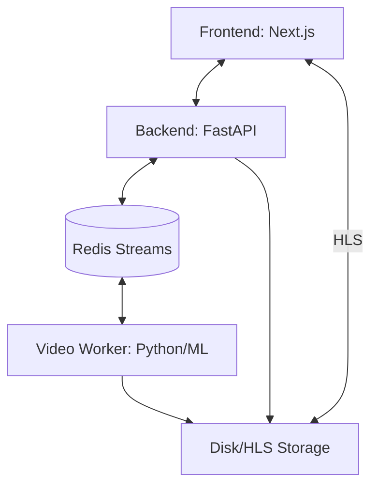

# InfiniteTalk Project Knowledge Base

> [!IMPORTANT]
> **Core Rules for AI Agents (Long-Term Memory)**
> 1. **Read First**: Always read this file (`KNOWLEDGE.md`) at the start of a session to understand the current architecture and state.
> 2. **Update Always**: After implementing significant changes (architectures, new services, bug fixes), update the relevant sections of this file.
> 3. **Preserve "Why"**: Don't just document *what* changed, but *why* it was changed to prevent regressing on past decisions.
> 4. **No Placeholders**: Never use placeholder descriptions; ensure technical details are accurate and derived from the source code.

This file serves as a persistent technical memory for the project. It describes the "why" and "how" of the current implementation, key architectural decisions, and operational safety measures.

## 🏗️ Core Architecture

The project follows an asynchronous streaming architecture to maintain low latency for talking avatar generation.

### 1. Frontend (`/web`)
- **Tech Stack**: Next.js, Tailwind, Hls.js.
- **HLS Management**: Uses a singleton `hlsRef` and `isAttachingRef` to prevent "MediaSource" attachment race conditions.
- **Logs**: Forwards `hls.js` logs/errors to the backend via WebSocket (`type: client_log`) for centralized debugging.

### 2. Backend (`/src/app`)
- **Tech Stack**: FastAPI, WebSockets, FFmpeg.
- **HLS Writer**: Manages the `manifest.m3u8`.
    - **Idle Mode**: Seeds the manifest with `idle_XXXXXX.m4s` segments generated by a global FFmpeg process.
    - **Live Mode**: Remuxes `.mp4` results from workers into fragmented `.m4s` segments.
    - **Transitions**: Uses `#EXT-X-DISCONTINUITY` and `#EXT-X-MAP:URI="init.mp4"` to handle stream changes.

### 3. Audio Pipeline (TTS)
- **Flow**: LLM Tokens → ElevenLabs WebSocket → MP3 Chunks → FFmpeg (PCM) → `RollingWav` → Redis.
- **Audio Specs**: 16kHz, mono, s16le.
- **RollingWav**: Accumulates PCM bytes and slices them into overlapping windows (default: 1800ms length, 250ms overlap).

### 4. Video Worker (`/InfiniteTalk/workers/video`)
- **Input**: Listens to Redis Stream `audio_windows`.
- **Processing**: Runs `generate_infinitetalk.py` (GPU/ML).
- **Output**: Publishes to Redis Stream `mp4_ready` and saves to `output/`.
- **Cleanup**: Retains only the 5 most recent generated videos to save space.

## � Redis Event Mapping

| Stream          | Producer            | Consumer            | Data Payload                               |
| :-------------- | :------------------ | :------------------ | :----------------------------------------- |
| `audio_windows` | Backend (`Session`) | Video Worker        | `{job_id, input_data: {audio_path}, args}` |
| `mp4_ready`     | Video Worker        | Backend (`Session`) | `{job_id, video_path}`                     |

## 🛡️ Safety & Testing Controls

| Variable           | Description                                                                                        |
| :----------------- | :------------------------------------------------------------------------------------------------- |
| `ALLOW_GENERATION` | Must be `true` for the worker to run real ML processing.                                           |
| `DRY_RUN`          | If `true`, the worker skips subprocess calls but acknowledges messages.                            |
| `FAKE_RUN`         | If `true`, the worker copies `idle_loop.mp4` to the output to verify the full pipeline end-to-end. |
| `USE_STUBS`        | If `1`, the backend uses mock data for some services.                                              |

## 📼 HLS Streaming Mechanics

- **Initialization**: `init.mp4` contains the fMP4 header metadata.
- **File Naming**:
    - Idle: `idle_XXXXXX.m4s` (generated once/looped).
    - Live: `seg_XXXX.m4s` (unique per session/sequence).
- **Atomic Updates**: `manifest.m3u8` is written to a `.tmp` file first and then atomically renamed to ensure clients never read incomplete playlists.
- **Directory Invariants**: `HLS_DIR`, `AUDIO_DIR`, and `STATIC_DIR` must be shared/mirrored between Backend and Worker if they run on different hosts/containers.

## ⚠️ Known Gotchas & Patterns

1. **Duplicate Env Vars**: Ensure `.env` does not have duplicate `HLS_DIR` entries (common cause of segments staying "stuck" in one folder while the API looks at another).
2. **Path Resolution**: Use absolute paths in `.env` to avoid `FileNotFoundError` when workers run from different CWDs.
3. **FFmpeg Imports**: `HLSWriter` requires `contextlib` for suppressed error handling during manifest writes.
4. **WebSocket Blocking**: Avoid heavy CPU tasks in the FastAPI WS handler; offload to the Redis/Worker pipeline.
5. **Singleton HLS**: Replacing the `<video>` element's `src` while an HLS instance is attached causes standard MediaSource errors. Always `hls.destroy()` before switching modes.
6. **Sliding Window vs Event**: `HLSWriter` must have `delete_old=True` to be a true "Sliding Window". `EXT-X-PLAYLIST-TYPE:EVENT` should only be used if `delete_old=False` (growing playlist). Mixing them causes playback stalls.

## 🛠️ Operations & Setup

- **Git Strategy**: Monorepo. Sub-modules (like `InfiniteTalk`) are flattened (remove `.git` folders) to ensure all code is versioned together.
- **Model Caching**: On RunPod, models are often at `/runpod-volume/huggingface-cache/hub/`. Use `runpod_utils.py` to locate them.

## ✍️ How to Contribute to Knowledge

Maintain this file as the Project's "Long-Term Memory". 

1. **When to Update**:
   - After fixing a non-obvious bug (add to **Known Gotchas**).
   - When adding a new service or pipeline (update **Core Architecture**).
   - When changing message formats or Redis topics (update **Redis Event Mapping**).
2. **Format**:
   - Keep it concise.
   - Use Mermaid for diagrams.
   - Use tables for configurations/mappings.
   - Link to code files when possible.
